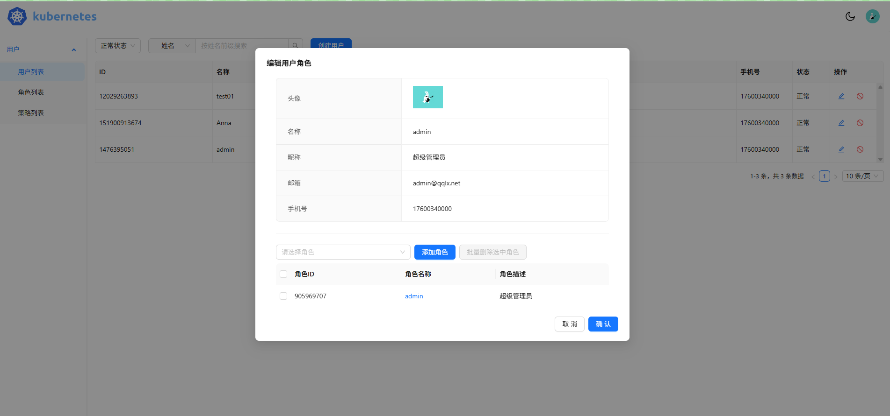
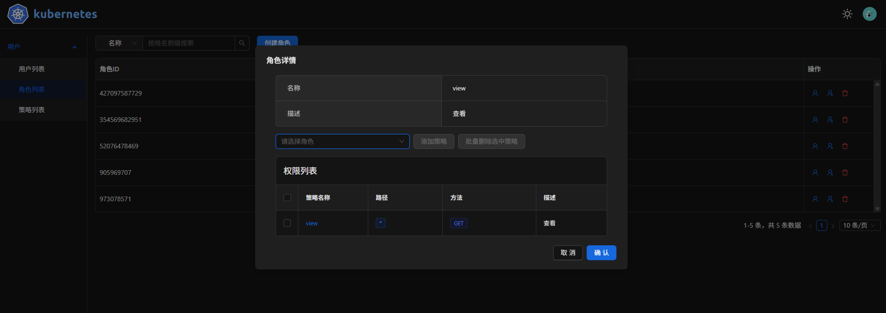

# 用户管理前端

后端地址：[https://github.com/qinquanliuxiang/go-web](https://github.com/qinquanliuxiang/go-web)

## 展示




## 开发环境

基于 react + typescript + antd + vite

## 功能

1. 用户登录
2. 用户注册
3. 用户管理
4. 权限管理
5. 角色管理

## 运行

```bash
  yarn install
  yarn dev
```
